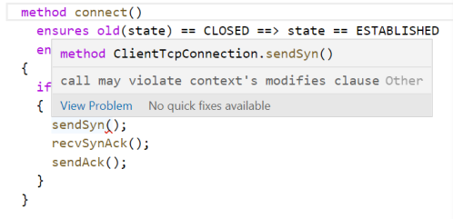

# Dafny Tutorial

## Setup

This repository is configured to build and open a Docker container that contains the dependencies needed to run Dafny.
Below are the steps to mount this repository onto the Docker development container:
1. Clone this repository on your local machine `git clone https://github.com/byu-cs329-winter2022/dafny-tutorial.git`
2. Ensure that Docker is running (If you run into issues, try restarting Docker)
3. Open VS Code and run the `Remote-Containers: Open Folder in Container...` command
4. Select this repository `dafny-tutorial` as the folder to open. VS Code will automatically build the container. This may take some time depending on your computer processing speed.


5. After building the container, you should see in the bottom left corner of VS Code that you are developing in `Dev Container: Dafny`.
6. Open the `tcp.dfy` file. In the terminal, you should see Dafny being installed automatically.

## Overview: Modeling TCP Connection

In this tutorial, you will be following the instructions below and modifying the `tcp.dfy` file to model the Client side of establishing and closing TCP connections.
First, read through this short explanation about the TCP handshakes for opening and closing connections: [https://blog.confirm.ch/tcp-connection-states/](https://blog.confirm.ch/tcp-connection-states/).

You won't be writing the actual code to create TCP connections in Dafny. You will be _modeling_ the computation and state changes. This simplification will allow you to focus on the syntax of Dafny contracts and how verification works. Hopefully through this example you will see the benefit of **proving** properties of software.

The Dafny code will model three key methods from the _client_ side in the `ClientTcpConnection` class: `connect` where the client initiates opening a connection with the server, `close` where the client initiates closing the connection with the server, and `terminate` where the client receives a request to close the connection with the server.

The Dafny code will also model the TCP state and other helper methods that implement the protocols for opening and closing connections.

## Creating the Code

### TCP state as Dafny datatype

In Dafny, one can create an enumerated type for all possible values of the TCP state with the following code (this is already in the `tcp.dfy`):
```dafny
  datatype STATE = SYN_SENT | ESTABLISHED | FIN_WAIT_1 | FIN_WAIT_2 |
                 CLOSE_WAIT | CLOSING | LAST_ACK | TIME_WAIT | CLOSED
```
The class variable `state` of type `STATE` will store the current TCP state:
```dafny
  var state: STATE;
```

### Boolean Helper Methods

You will create two boolean helper methods, `isClosed` and `isEstablished`, which will be used to verify the TCP state of the connection.

Add the following code to the `ClientTcpConnection` class:
```dafny
  method isClosed() returns (result: bool)
  {
    if (state == CLOSED)
    {
      result := true;
    }
    else 
    {
      result := false;
    }
  }
```
This method is missing the contract. The first question is: what, if any, are the requirements on the state of the `ClientTcpConnection` object that must be satisfied for this method to work properly? There are none, since this method isn't modifying the state of the object; the method is simply reading and returning information about the state of the object. No `requires` clauses are needed. The next question is: what does the method guarantee when the requires are met? Since the object isn't being modified, the only guarantee is about the return value. Looking at the method, it can be determined that the return value will always be the same value as the boolean expression `state == CLOSED`.

Add the following `ensures` statement for the method `isClosed`: `ensures result == (state == CLOSED)`. Dafny will run the verification to try to prove this `ensures` statement based on the `requires` (there are none) and the implementation of the method. The verification will be successful.

You should now have:
```dafny
  method isClosed() returns (result: bool)
    ensures result == (state == CLOSED)
  {
    if (state == CLOSED)
    {
      result := true;
    }
    else 
    {
      result := false;
    }
  }
```

The next helper boolean method is `isEstablished`. Give a try to create the method and return whether or not the `state` is `ESTABLISHED`. Click on "Check" below to check your work.

<details><summary>Check</summary>
  <p>
    
  ```dafny
  method isEstablished() returns (result: bool)
  {
    if (state == ESTABLISHED)
    {
      result := true;
    }
    else 
    {
      result := false;
    }
  }
  ```
    
  </p>
</details>

Now think about the contract (refer to `isClosed`). Check your work.

<details><summary>Check</summary>
  <p>
    
  ```dafny
  method isEstablished() returns (result: bool)
    ensures result == (state == CLOSED)
  {
    if (state == ESTABLISHED)
    {
      result := true;
    }
    else 
    {
      result := false;
    }
  }
  ```
    
  </p>
</details>

### Constructor

Next you will create the constructor. Note that in Dafny, you create a constructor just like a method, replacing the `method` keyword with the `constructor` keyword instead. You can name the constructor method as `init()`. Create the constructor and its specifications, initializing the TCP state to `CLOSED`. 

Try it out and then check your work.
<details><summary>Check</summary>
<p>
    
```dafny
  /**
   * Constructor: state will always start as CLOSED
   */
  constructor init()
    ensures state == CLOSED
  {
    state := CLOSED;
  }
```

You may think the `ensures` statement seems redundant, but remember that the contract will be used when this constructor method is called later.

</p>
</details>

### Connect, Close, and Terminate

Now you will add in the three core methods: `connect`, `close`, and `terminate`. Refer back to the TCP diagrams in: [https://blog.confirm.ch/tcp-connection-states/](https://blog.confirm.ch/tcp-connection-states/).

Here is the code for `connect`, without any contracts:
```dafny
  /**
   * This method represents a client starting the 3-way handshake
   *   with a server to establish a TCP connection.
   */
  method connect()
  {
    if (state == CLOSED)
    {
      sendSyn();
      recvSynAck();
      sendAck();
    }
  }
```

Think about the necessary contract for `connect`. What, if any, are the requirements (`requires` clauses) on the `state`? What, are the guarantees (`ensures` clauses) for the `state`? Check below and add the clause(s) for the `connect` contract.

<details><summary>Check</summary>
<p>
  
```dafny
  ensures old(state) == CLOSED ==> state == ESTABLISHED
  ensures old(state) != CLOSED ==> state == old(state)
```
  
  The `ensures` clauses claim than when the `state` was `CLOSED` before the method call, the `state` will be `ESTABLISHED` afterward. If the `state` was not `CLOSED`, the value of `state` was not changed. The `==>` in Dafny is the logical _conditional_ or _implication_ operator. Be careful when using it. Recall that `F ==> T` is always true. This leads to `ensures` clauses that are always true, but don't help with verification.
  
</p>
</details>

Here is the code for `close`, without any contracts:
```dafny
  /**
   * This method represents a client starting the 4-way handshake
   *   with a server to close an established TCP connection.
   */
  method close()
  {
    if (state != CLOSED)
    {
      sendFin();
      recvAck();
      recvFin();
      sendAck();
      timeout();
    }
  }
```

Think about the necessary contract for `close`. What, if any, are the requirements (`requires` clauses) on the `state`? What, are the guarantees (`ensures` clauses) for the `state`? Check below and add the clause(s) for the `close` contract.

<details><summary>Check</summary>
<p>
  
```dafny
  ensures state == CLOSED
```
  
</p>
</details>

Here is the code for `terminate`, without any contracts:
```dafny
  /**
   * This method represents a client terminating an established
   *   TCP connection from a server request to close.
   */
  method terminate()
  {
    recvFin();
    sendAck();
    sendFin();
    recvAck();
  }
```

Think about the necessary contract for `terminate`. What, if any, are the requirements (`requires` clauses) on the `state`? What, are the guarantees (`ensures` clauses) for the `state`? Check below and add the clause(s) for the `terminate` contract.

<details><summary>Check</summary>
<p>
  
```dafny
  requires state == ESTABLISHED
  ensures state == CLOSED
```

It may not be obvious why the `requires` is needed. It is there since we only want to verify that the `terminate` method works when the connection is already `ESTABLISHED`. Otherwise, we'd need to make the code more complex.
  
</p>
</details>

:arrow_right: Note: since there are missing implementation and contracts, don't worry about whether or not Dafny verifies. That will come later.

### Verification: Test Methods

We want to verify that calls to `connect`, `close`, and `terminate` will _always_ end in the correct TCP state, either `CLOSED` or `ESTABLISHED`. To do this we will create three test methods that will each run a _proof_ for one of those methods. We usually put these test methods at the bottom of a Dafny file.

Here is what the first proof should do:
 1. Create a new object of type `ClientTcpConnection` and call its constructor, which will be named `init`
 2. Verify that the connection is `CLOSED`
 3. Call the `connect` method
 4. Verify that the connection is `ESTABLISHED`

The corresponding code is as follows:
```dafny
  /**
   * Test client initiate connect
   */
  method test_ClientConnect()
  {
    var client := new ClientTcpConnection.init();
    var isClosed: bool := client.isClosed();
    assert (isClosed);
    client.connect();
    var isEstablished: bool := client.isEstablished();
    assert (isEstablished);
  }
```

Here is what the second proof should do:
 1. Create a new object of type `ClientTcpConnection` and call its constructor, which will be named `init`
 2. Verify that the connection is `CLOSED`
 3. Call the `connect` method
 4. Verify that the connection is `ESTABLISHED`
 5. Call the `close` method
 6. Verify that the connection is `CLOSED`

Try to create this second test method, then check your code.

<details><summary>Check</summary>
  <p>
    
  ```dafny
  /**
   * Test client initiate close after connect
   */
  method test_ClientConnectThenClientClose()
  {
    var client := new ClientTcpConnection.init();
    var isClosed: bool := client.isClosed();
    assert (isClosed);
    client.connect();
    var isEstablished: bool := client.isEstablished();
    assert (isEstablished);
    client.close();
    isClosed := client.isClosed();
    assert (isClosed);
  }
  ```
    
  </p>
</details>

Here is what the third, and final, proof should do:
 1. Create a new object of type `ClientTcpConnection` and call its constructor, which will be named `init`
 2. Verify that the connection is `CLOSED`
 3. Call the `connect` method
 4. Verify that the connection is `ESTABLISHED`
 5. Call the `terminate` method
 6. Verify that the connection is `CLOSED`

Try to create this third test method, then check your code.
<details><summary>Check</summary>
  <p>
    
  ```dafny
  /**
   * Test server initiate close after connect
   */
  method test_ClientConnectThenServerClose()
  {
    var client := new ClientTcpConnection.init();
    var isClosed: bool := client.isClosed();
    assert (isClosed);
    client.connect();
    var isEstablished: bool := client.isEstablished();
    assert (isEstablished);
    client.terminate();
    isClosed := client.isClosed();
    assert (isClosed);
  }
  ```
    
  </p>
</details>

:arrow_right: Note: we still aren't going to worry about any Dafny errors. Even if the above `assert`s don't show an error, it is meaningless until we fill out the contracts and fix all other errors.

### Helper Methods

The `connect`, `close,` and `terminate` methods call the following helper methods: `sendSyn`, `recvSynAck`, `sendAck`, `sendFin`, `recvAck`, `recvFin`, `sendAck`, and `timeout`.
You will be modeling how the `state` changes in each of these methods. You will not implement any of the other details. Recall that the Dafny code is only modeling the _client_ side.

The first method is `sendSyn`. This method is called at the start of the `connect` method to kick-off the 3-way handshake with the server. Here is the implementation and contract:
```dafny.
  method sendSyn()
    modifies `state
    ensures state == SYN_SENT
  {
    state := SYN_SENT;
  }
```
Note the need for the `modifies` clause. Also note that you will not be modeling any message passing.

The second method is `recvSynAck`. This method should only change the `state` if the connection is in the `SYN_SENT` state. Here is the implementation:
```dafny
  method recvSynAck()
  {
    if (state == SYN_SENT)
    {
      state := ESTABLISHED;
    }
  }
```
Try to figure out what the contract should be. Then check your work.
<details><summary>Hint</summary>Look at the `connect` contract and how it uses the logical implication. Don't forget the `modifies` clause.</details>

<details><summary>Check</summary>
  <p>
    
```dafny
  method recvSynAck()
    modifies `state
    ensures old(state) == SYN_SENT ==> state == ESTABLISHED
    ensures old(state) != SYN_SENT ==> state == old(state)
  {
    if (state == SYN_SENT)
    {
      state := ESTABLISHED;
    }
  }
```
    
  </p>
</details>

The third method is `sendAck`. This method doesn't every change the `state` of the connection. But we'll keep it as a placeholder since it is part of all the protocols:
```dafny
  /**
   * Sending an ACK does not change the state.
   */
  method sendAck()
  {
    // no update to state
  }
```
There is no need for a contract with this method since it has _zero_ affect on the object.

If you'd like to challenge yourself, try implementing and writing the contracts for the rest of the helper methods. Check your work.
<details><summary>Check `sendFin`</summary>
  <p>
    
```dafny
  method sendFin()
    modifies `state
    ensures old(state) == CLOSE_WAIT ==> state == LAST_ACK
    ensures old(state) != CLOSE_WAIT ==> state == FIN_WAIT_1
  {
    if (state == CLOSE_WAIT)
    {
      state := LAST_ACK;
    }
    else 
    {
      state := FIN_WAIT_1;
    }
  }
```
    
  </p>
</details>

<details><summary>Check `recvAck`</summary>
  <p>
    
```dafny
  method recvAck()
    modifies `state
    ensures old(state) == FIN_WAIT_1 ==> state == FIN_WAIT_2
    ensures old(state) == LAST_ACK ==> state == CLOSED
  {
    if (state == FIN_WAIT_1)
    {
      state := FIN_WAIT_2;
    }
    else if (state == LAST_ACK)
    {
      state := CLOSED;
    }
  }
```
    
  </p>
</details>

<details><summary>Check `recvFin`</summary>
  <p>
    
```dafny
  method recvFin()
    modifies `state
    ensures old(state) == FIN_WAIT_2 ==> state == TIME_WAIT
    ensures old(state) != FIN_WAIT_2 ==> state == CLOSE_WAIT
  {
    if (state == FIN_WAIT_2)
    {
      state := TIME_WAIT;
    }
    else
    {
      state := CLOSE_WAIT;
    }
  }
```
    
  </p>
</details>

<details><summary>Check `timeout`</summary>
  <p>
    
```dafny
  method timeout()
    modifies `state
    ensures state == CLOSED
  {
    state := CLOSED;
  }
```
    
  </p>
</details>

### Completing the Verification

All of these helper methods should now pass Dafny verification. But there are still errors in `connect`, `close`, and `terminate`. Hover over the method call to `sendSyn` in the `connect` method. It will show an error like the following:


This message is saying that since `state` is changed inside the `sendSyn` method (which is called by `connect`) `connect` needs to also have the ``modifies `state`` clause in its contract. Add the needed `modifies` clause. Now the verification for `connect` should pass. Do the same for both `close` and `terminate`, which have the same problem.

Dafny should now pass all verification ✔️ You should see the following in VS Code: 

Now, try to think up and implement another test method that might be interesting. Check your work.

<details><summary>Suggestion</summary>Calling <code>close</code> on a newly constructed connection object should still be provably <code>CLOSED</code>.</details>

<details><summary>Check extra test</summary>
  <p>
    
```dafny
  /**
   * Test calling 'close' twice
   */
  method test_ClientCloseTwice()
  {
    var client := new ClientTcpConnection.init();
    var isClosed: bool := client.isClosed();
    assert (isClosed);
    client.close();
    isClosed := client.isClosed();
    assert (isClosed);
  }
```
    
  </p>
</details>

## Grading
Congratulations❗You have completed the Dafny tutorial 🥳
Upon completion of the homework and uploading of your pull request, GitHub will give you a sanity check by verifying your Dafny code.
Don't forget to submit your pull request in Canvas.
